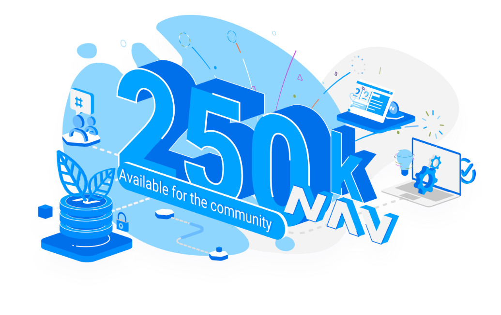

<section class="cf-hero">
    

      

        <h1>Community Fund</h1>
        
The NavCoin community fund is a pool of funds that are set aside to help kickstart community projects. NavCoin was built from the ground up - it’s an open-source community project that ran no premine or ICO. So as an extension of this ethos, this fund has been created to help incentivise the ongoing development of NavCoin in a decentralised manner.Anyone and everyone on the network will be able to propose projects, vote, and initiate payments. These proposals can be for anything - the only requirement is for the network to vote ‘yes’.

      

      
    

  </section>
  

    
    
    



    
    
    
    
    
    




{{< accordion
  titleText="How to create a proposal"
  subtitleText="We’ve got a process to help you ensure your proposal has the best chance of passing."
  itemOneTitle="Step 1 - Develop your ideas."
  itemOneText="Think of things that could inspire the NavCoin network. You can go it alone or discuss it with the community in <a href=\"https://reddit.com/r/navcoin\">Reddit</a> or <a href=\"https://discord.gg/dRyhDjm\">Discord</a>."

  itemTwoTitle="Step 2 - Create a project page."
  itemTwoText="It can be anywhere, but to give your project maximum visibility in the community consider using the <a href=\"\">Collab website</a>. Work out the details of the project. You need to communicate why the NavCoin community should fund it, if you need to tap into other people’s skills, and how long it will take from start to finish. Your proposal might suiting being funded in stages, especially if it’s long term devising a roadmap will help."

  itemThreeTitle="Step 3 - Create your team."
  itemThreeText="Do you need other skills to bring your project to life? Use NavCoin’s social channels and the Collab website to find community members who can help you complete your project."
  
  itemFourTitle="Step 4 - Submit your proposal."
  itemFourText="Complete the proposal form, including a link to your project page. Pay the proposal fee. The projects that pay the highest fees to the network will be accepted first. A fee is necessary to stop people spamming the Community Fund with weak proposals."
  
  itemFiveTitle="Step 5 - Promote your project to stakers."
  itemFiveText="Once you’ve submitted your proposal, promote your project using the community channels. Communicate why you think it’s worth funding what benefits will it bring? Why should the community support it?"
  
  itemSixTitle="Step 6 - Voting begins."
  itemSixText="To be eligible to vote you must be staking NavCoin. Each voting period lasts 20,000 blocks. The minimum number of stakers voting yes/no needs to be 50% Of that 50%, a proposal must receive 75% ‘yes’ votes to be accepted 67.5% ‘no’ votes will result in it being rejected."
  
  itemSevenTitle="Step 7 - Begin the work."
  itemSevenText="Start work and do your best to stick to your timeline. Keep the community updated with how things are progressing in your project. It’s OK to ask for help along the way."
  
  itemEightTitle="Step 8 - Apply for payment."
  itemEightText="Once your project is complete you can apply for payment from the Community Fund. If there are clear milestones in your proposal you can apply to receive payments at scheduled points in the timeline. Payment is subject to a second consensus vote among NavCoin stakers. There must be a 50% minimum participation, with 50% ‘yes’ vote to be paid and 50% ‘no’ for payment to be rejected."
>}}